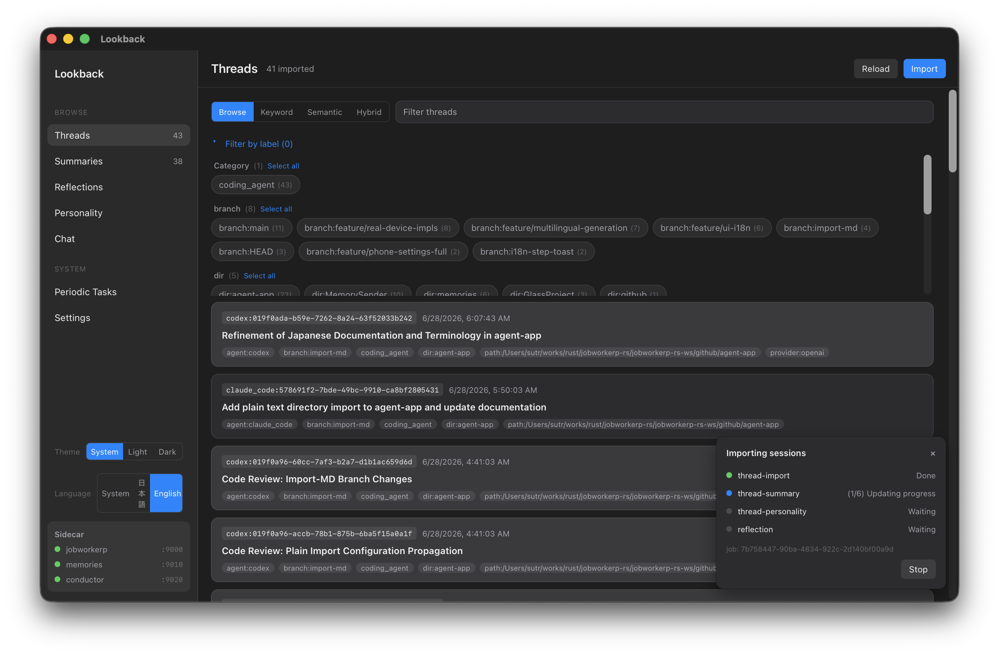

# Lookback

Lookback is a cross-platform Tauri desktop app for turning local Claude Code and Codex session logs into searchable long-term memory.

It imports session logs into [`memory-store`](https://github.com/jobworkerp-rs/memory-store), then lets you browse threads, generate summaries and reflections, inspect personality signals, and ask RAG questions from a desktop UI.

Japanese documentation is available in [README_ja.md](README_ja.md). Developer-focused setup, test, and environment details are in [docs/developer-guide.md](docs/developer-guide.md).

## Screenshot



## What You Can Do

- Import local `claude-code` and `codex` session logs.
- Import plain text (`.md` / `.txt`) from a directory as threads, grouping per file, per directory, or as a single thread.
- Browse imported threads and search them by keyword, semantic search, or hybrid search.
- Generate thread, daily, weekly, and monthly summaries.
- Generate reflections and personality profiles from past sessions.
- Ask questions against imported memory from the Chat tab.
- Expose the RAG recall tool to external MCP clients.
- Schedule periodic import and summary tasks through the bundled conductor backend.

## Supported Platforms

Lookback targets Tauri-supported desktop platforms. The current repository is set up for macOS and Linux builds.

Local LLM execution currently supports only Qwen 3.5/3.6-family and Gemma 4-family models. The default local preset is the non-MTP Gemma 4 E2B IT QAT preset because Lookback summarizes before chat; MTP presets remain available for chat-focused use. Gemma 4 MTP initializes the runner with the QAT target GGUF plus a separate draft GGUF. Use an external LLM provider for other model families.

## Required Components

The app UI lives in this repository, but running the complete desktop app also needs bundled backend binaries and jobworkerp plugins:

- [`jobworkerp`](https://github.com/jobworkerp-rs/jobworkerp-rs): `all-in-one`
- [`memory-store`](https://github.com/jobworkerp-rs/memory-store): `front`, `memories-import`, and `migrate-memory-kind`
- [`jobworkerp-conductor`](https://github.com/jobworkerp-rs/jobworkerp-conductor): `conductor-main`
- `protoc`: the official self-contained protobuf compiler, fetched automatically by the build
  (children run it to compile runner schemas at worker-registration time, so it is shipped as a
  bundled binary)
- [`llama-cpp-runner`](https://github.com/jobworkerp-rs/llama-cpp-runner): local LLM runner plugin
- [`mm-embedding-runner`](https://github.com/jobworkerp-rs/mm-embedding-runner): embedding runner plugin

Frontend checks can run without these binaries. Running the complete app, importing logs, loading models, and building distributable packages require them.

## Build From Source

### Prerequisites

Install these on the build host before building:

- Rust toolchain compatible with edition 2024 (rustc >= 1.85), installed via `rustup`.
- Node.js and `pnpm`.
- Tauri v2 prerequisites for your OS.
- Build tools used by the backend repositories and their native dependencies:
  `git`, `cmake`, `pkg-config`, and `curl` / `unzip` / `tar`. The official `protoc` is downloaded
  by the build (via `curl` + `unzip`), so the host does not need protoc installed; set `PROTOC` to
  a self-contained protoc to build offline.
  - macOS: Xcode Command Line Tools (`xcode-select --install`) and, via Homebrew,
    `brew install cmake pkgconf`.
  - Linux (Debian/Ubuntu): `apt-get install -y cmake pkg-config build-essential`.
- For a CUDA build on Linux: the CUDA toolkit (`nvcc`); `libcudnn` / `libnccl` for the full runtime.

### Automated build (recommended)

`scripts/build-release.sh` clones the five public backend repositories, builds them with the
right features for your platform and GPU backend, stages the binaries / plugins / lindera
dictionary where Tauri expects them, and runs `pnpm tauri build`:

```bash
# macOS (Metal GPU, DMG + .app)
scripts/build-release.sh --profile mac

# Linux (CUDA GPU, deb + AppImage)
scripts/build-release.sh --profile linux-cuda
```

Useful flags: `--skip-clone` (reuse existing clones), `--only <repos>` (rebuild a subset),
`--workdir <dir>` (clone/build location, default `.build-deps/`), `--skip-frontend`,
`--lindera skip`. Run `scripts/build-release.sh --help` for the full list, or prefix with
`DRY_RUN=1` to preview the commands without running them.

The generated package, such as a macOS `.app` / DMG or a Linux package target, includes the UI,
workers, optional search dictionary files, plugins, and bundled backend binaries according to
`src-tauri/tauri.conf.json`.

### Manual build

If you build the backend components yourself, place the outputs as follows and run
`pnpm install && pnpm tauri:build`:

1. Put the backend binaries in `src-tauri/bin/` with the target-triple suffix Tauri expects
   (such as `-aarch64-apple-darwin`, `-x86_64-apple-darwin`, or the Linux target triple):

   ```text
   src-tauri/bin/all-in-one-<triple>
   src-tauri/bin/front-<triple>
   src-tauri/bin/conductor-main-<triple>
   src-tauri/bin/memories-import-<triple>
   src-tauri/bin/migrate-memory-kind-<triple>
   src-tauri/bin/protoc-<triple>
   ```

2. Build the runner plugins (`libjobworkerp_llama_cpp_plugin` and `libmm_embedding_runner`) for
   your target OS and place the shared libraries under `plugins/`.
3. Stage the migration toolkit from the **same `memories` checkout and revision** that produced
   `front`, `memories-import`, and `migrate-memory-kind`:

   ```bash
   scripts/stage-memory-kind-toolkit.sh /absolute/path/to/memories
   ```

   This fills `src-tauri/migration-toolkit/` with the client-apply runbook and SQL. Do not bundle
   the CI placeholder files; an existing database blocked for migration needs this real guide for
   recovery.
4. If your `memory-store` `front` build uses Lindera FTS, place the search dictionary under
   `dict/lindera/ipadic` (lindera 3.x format with `metadata.json`). Lookback packages and stages
   this directory for `memory-store`; it does not load the dictionary directly.

For development launch commands and path overrides, see [docs/developer-guide.md](docs/developer-guide.md).

## First Run Tutorial

1. Start Lookback.
2. Complete the setup wizard:
   - Choose the data root and Hugging Face cache location.
   - Choose a local or external LLM provider.
     - External LLM API keys are stored in the OS credential store, such as Keychain.
   - Choose the embedding model.
   - Confirm the backend and model readiness checks.
3. Open **Settings** later if you need to change providers, model paths, cache paths, language, timezone, or MCP exposure.
   - **Embedding model** remains editable when Connection is **Remote server**. For semantic or hybrid search, local article embeddings are not generated, so match the local query embedding model and vector dimension to the remote server embeddings. Remote-server changes do not reset or regenerate the local embedding index. Local memories SQLite/LanceDB is neither started nor read; all memories reads and writes use the remote endpoint. Startup verifies required memories services and thread-label RPC schemas through gRPC Server Reflection, so the remote must be memory_kind-migrated, support the `memory_kinds` filters for thread-label RPCs, and expose Reflection v1. Deploy a matching updated memories binary; older binaries are rejected because they ignore this field and can mix non-RAW labels into the Threads tab.
   - **Timezone** controls the wall-clock boundaries used by summaries, imports, and timestamp display. **Auto** follows the app environment / OS timezone; saving an explicit timezone restarts the sidecar because worker processes read `TZ` at startup. This setting is disabled while Connection is **Remote server** because the remote workflows use the remote server environment.
4. Open **Threads** and click **Import** to import Claude Code or Codex session logs. To import a directory of plain text instead, check **Plain text (directory)**, choose the target directory, and pick a thread split strategy:
   - **Per file**: one thread per file.
   - **Per directory**: files in the same directory become one thread.
   - **Single thread**: the whole directory becomes one thread.

   Plain import reads `.md` / `.txt` files recursively. An optional **Source name** (`a-z0-9_-`, up to 32 chars) namespaces the imported threads; leave it empty to use the importer default. Plain text can be imported together with Claude Code / Codex in the same run.
5. Browse imported threads from **Threads**. Use keyword search first; use semantic or hybrid search when the embedding runner is ready.
6. Open **Summaries** to generate or inspect thread and period summaries.
7. Open **Reflections** and **Personality** to generate higher-level observations from imported sessions.
8. Open **Chat** and ask questions about your imported history. Source links in answers take you back to the relevant threads or summaries.
9. Open **Periodic Tasks** if you want Lookback to import and summarize on a schedule.

## MCP Server

Lookback can expose its RAG recall capability as an MCP server for external MCP clients such as Claude Desktop. The MCP server runs inside the bundled `jobworkerp` sidecar alongside the app's normal gRPC backend, so enabling it does not replace the in-app browse, import, or chat features.

The MCP surface is limited to the `lookback-mcp-rag` function-set. Currently this exposes one tool:

- `lookback_recall`: searches both generated summaries and original imported messages for prior conversations, decisions, and work history.

To enable it:

1. Open **Settings**.
2. In **MCP Server**, enable the server.
3. Save the settings. Lookback restarts the sidecar because MCP is configured at sidecar startup.
4. Copy the displayed connection URL. The preferred local URL is usually:

```text
http://127.0.0.1:39010/mcp
```

If that port is already in use, Lookback picks another free port and shows the actual URL in Settings.

5. Add the URL to your MCP client using streamable HTTP transport. Example client configuration:

```json
{
  "mcpServers": {
    "lookback": {
      "url": "http://127.0.0.1:39010/mcp"
    }
  }
}
```

When Lookback is configured to browse a remote `memory-store`, MCP search follows the same active memory target where possible. If the remote URL is invalid or missing, the RAG workflow falls back to the local sidecar memory endpoint.

## App Data

Lookback stores persistent data in the OS application data directory. Common defaults are:

```text
macOS: ~/Library/Application Support/lookback/
Linux: ~/.local/share/lookback/
```

This root contains SQLite and LanceDB data, staged plugins, model cache settings, backend process logs, connection settings, and the PID file used for orphan process cleanup. The Settings page can purge the data root.

## Related Documentation

- [README_ja.md](README_ja.md): Japanese README.
- [docs/developer-guide.md](docs/developer-guide.md): developer guide.
- [workers/README.md](workers/README.md): worker/workflow YAML bundle.
